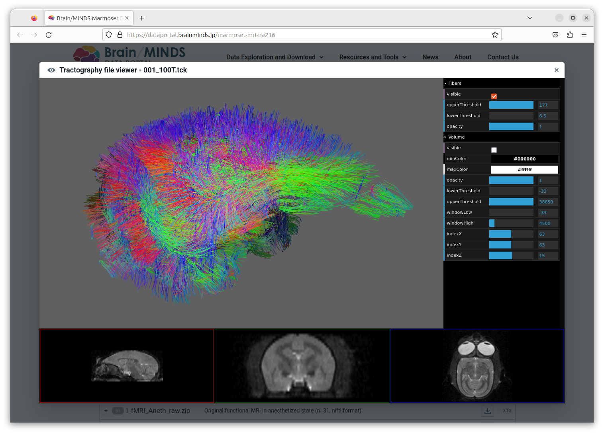
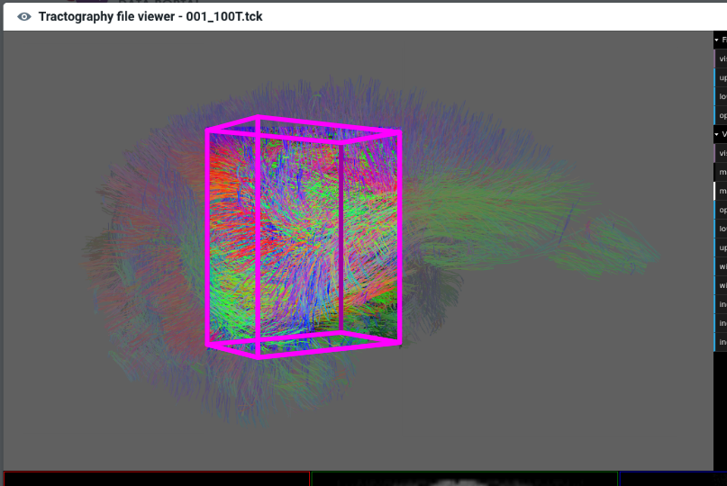

# Hackhathon topic - Improving Tractography preview for better data exploration

## Context

On the dataportal (see [NA216 dataset](https://dataportal.brainminds.jp/marmoset-mri-na216)), tractography data can be inspected with an online previewer leaveraging [XTk](https://github.com/xtk/X) javascript library.
In practice, the rendered data often looks like a dense ball of fibers, and that's not so easy to explore the fibers details, especially for the inner regions which are  obscured by outer regions.




Indeed, with Xtk it's only possible:

* to change the opacity of all fibers (of a trk file) at once, 
* to hide some of them depending on their length (by setting min and max fibers length filter values).


## Proposal

It would be good to somehow be able to only view fibers inside a user-defined region of the space.
(Tanaka-sensei proposal "three othogonal guide 'planes' of some thickness. Center and thickness can be specified in the UI with sliders").

Ideally by continuing using Xtk  which is currently used by the online preview.

### Goal

Extending tractography viewer to only display fibers in a user-defined volume (rectangular cuboid aligned to axis).

It means cropping the fiber rendering outside of the user defined volume, as figured in the schema below:



## Implementation

### Analysis of existing code

* XTk is webGL powered; It defines a couple of generic shaders (in [`shader.js`](https://github.com/xtk/X/blob/master/visualization/shaders.js)) that can handle rendering of NifTI volumes, tractography fibers and more.
<br/>(see [Webgl fundamentals](https://webglfundamentals.org/webgl/lessons/webgl-fundamentals.html) for explanations about Webgl shaders)

* The shaders already includes mechanisms to adjust rendering of loaded objects depending on the value of user-defined criteria.
For example, in case of tractography data, some individual fibers may be masked depending on their overall length.

* Fiber files in TrackVis format (`.trk` ) are parsed by [`parserTRK.js`](https://github.com/xtk/X/blob/master/io/parserTRK.js). Each fiber segment is assigned a few _scalars_, including the overall length of the fiber they belong to. This enables the shader to discard the rendering of segments depending the length of their fiber.
<br/>(For fibers, WebGLRendering mode is `LINES`, to draw lines segment between pairs of vertices. GLSL discard keyword is used the shaders to hide fiber segments.)

### Trials

#### Solution #1 - Fast & cheap

In a first approach, we could probably obtain the desired effect of volume cropping by simply preventing the rendering of fiber segments that extend outside the user-defined volume of interest (similar logic as length based fiber masking described above).
This simple approach is implemented first because it obly requires limited changes in the shaders [GLSL](https://en.wikipedia.org/wiki/OpenGL_Shading_Language) code (Xtk was written in GLSL ES 1.0); However, it has some limitations described below.

##### Limitations

This would work if fibers are composed of many short-length line segments (which seems a reasonable assumption since in practice fibers tend not to have long straight stretches).
<br/>But, because in this first approximation the fibers would not be strictly cut at the volume edges (but rather at the boundaries of the neighbouring segment completely contained in the cuboid), the volume boundaries might not appear neat.
<br/>Moreover, we have to expect that when users define very thin volume (compared to segment length), the number of rendered fibers might become artificially very low.

We'll need to asses whether these artefacts are acceptable in the context of an online preview.

##### Required changes

Basically :

* provide a UI to allow users to define their volume of interrest (cuboid) [use sliders with [dat](https://github.com/dataarts/dat.gui)],
* send the cuboid definition to the shader [by means of newly defined `UNIFORM`s],
* extend vertex shader GLSL code to discard any segment extending outside of the cuboid (at least one of its vertice is outside).


#### Solution #2 - Natural way but a bit more complicated

The first approach flaw is that it doesn't render at all segments that have some part outside of the cuboid volume.
Instead of discarding each of these segments as a whole, it is of course more natural to split these segments, discard the sub-segment outside of the volume while rendering the part inside.
<br/>It means redefining the coordinates of one or both vertices of the segment in the shader code, which is of course allowed.
But this requires much more changes in the code, and learn a bit more about shaders developement.

##### Issue

Although the vertex shader process one vertex at a time, we need both segment vertices coordinates to cut the segments at the cropping planes intersection, but it is not straightworward to obtain the other vertex coordinates in shader written in GLSL ES 1.0.

So we could take advantage of some functionnalities by switch to WebGL 2.0 (which is OK nowadays since [more 90% of browsers support it](https://caniuse.com/webgl2)), because the newer version of GLSL (ES 3.00) includes additions that are useful in our used case (such as built-in vertex shader variables [`gl_VertexID`](https://registry.khronos.org/OpenGL-Refpages/es3.0/html/gl_VertexID.xhtml) and others).
<br/>There some syntax changes in current shader code that need to be addressed to make it compatible with GLSL ES 3.00.


## Demos

* `demos/demo-before/` contains a standalone demo similar to the current preview available on Brain/MINDS data portal ([NA216 dataset](https://dataportal.brainminds.jp/marmoset-mri-na216)).

* `demos/demo-dev/` contains the demo that runs on the Xtk version being developed (i.e. the one shipped as submodule within this repo)

References:

* XTk Lesson **#06: Connectivity** http://lessons.goxtk.com/06/
* XTk Demo **FiberAtlas** http://demos.goxtk.com/brainfibers/

### How to run on your machine

#### Prerequisites

* git
* `npm` installed on your machine

#### 1. clone this repo

```sh
git clone https://github.com/bm-hackathon-23/tracto-preview
```

#### 2. Install small http server (run once)

Modern web-browsers don't allow loading local resources; Thus, a little http-server is needed for the demo to be able to load data.

```sh
cd tracto-preview/demos/
npm install
```

#### 3. Start http server

Depending on which demo you want to run, change the directory parameter for `http-server` on the following command :

```sh
cd tracto-preview/demos/

node_modules/http-server/bin/http-server demos/demo-before -p 8000

```

#### 4. Load http://127.0.0.1:8000/ in your web-browser.

#### 5. Stop http server

Press `[Ctrl]-c` to stop the server.


## DEV


### How to make change in Xtk

#### prepare working dir

```sh
cd tracto-preview/demos/demo-dev/X
git submodule init
git submodule update
```

Refer to Xtk's [developer wiki section](https://github.com/xtk/X/wiki/X%3ADevelopersHeadsUp).

#### Create builder docker image (run once)
 
Because Xtk project has not been updated for a while, we had trouble to run building scripts with nowadays' version of python/java.
<br/>We can instead use a dedicated container just for this task.

```sh

cd tracto-preview/scripts
docker build -f Dockerfile.xtk-builder  -t xtk-builder .

```

#### Prepare X submodule for DEV (run once, and after adding new files/classes)

```sh

cd tracto-preview/
docker run -it --rm --user $(id -u $USER):$(id -g $USER) --name xtk-run-build -v `pwd`/demos/demo-dev/X:/usr/src/X -w /usr/src/X xtk-builder python utils/deps.py

```


### Running demo with dev version of Xtk 

```sh
cd tracto-preview/demos/demo-dev
node_modules/http-server/bin/http-server . -p 8000
```

Load http://127.0.0.1:8000/ in your web-browser.


### Building a new Xtk bundle

[todo]